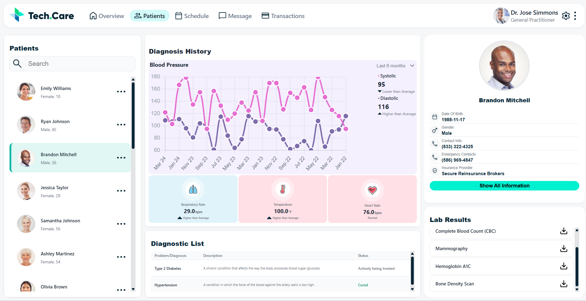

# Patient Health Dashboard

A modern, responsive healthcare dashboard application built with React and TypeScript. This application provides comprehensive patient health information, medical history, and diagnostic data visualization in an intuitive user interface.

## 🎯 Features

- **Patient Management**: View and manage patient profiles with detailed health information
- **Health Metrics Visualization**: Display vital signs and health metrics with interactive charts
- **Diagnostic Information**: Track diagnoses and medical history
- **Lab Results**: View and manage laboratory test results
- **Responsive Design**: Works seamlessly across desktop and tablet devices
- **Real-time Data**: Integration with healthcare APIs for live data updates
- **Error Handling**: Robust error boundary and error handling mechanisms

## 📸 Dashboard Preview

### Screenshot


### Screen Recording
[Watch the dashboard demo](./docs/videos/dashboard-demo.mp4)

## 🚀 Quick Start

### Prerequisites
- Node.js (v14 or higher)
- npm or yarn

### Installation

1. **Clone the repository**
```bash
git clone <your-repo-url>
cd patient-dashboard
```

2. **Install dependencies**
```bash
npm install
```

3. **Configure Environment Variables**
Create a `.env.local` file in the root directory:
```env
REACT_APP_API_BASE_URL=https://fedskillstest.coalitiontechnologies.workers.dev
```

4. **Start the development server**
```bash
npm start
```

The application will open in your browser at `http://localhost:3000`

### Build for Production
```bash
npm run build
```

## 🏗️ Project Structure

```
src/
├── components/          # Reusable React components
│   ├── DiagnosisChart.tsx
│   ├── DiagnosticList.tsx
│   ├── HealthMetrics.tsx
│   ├── LabResults.tsx
│   ├── PatientList.tsx
│   ├── PatientProfile.tsx
│   ├── Sidebar.tsx
│   └── Topbar.tsx
├── config/             # Configuration files
│   └── apiConfig.ts
├── constants/          # App constants
│   ├── assets.ts
│   ├── styles.ts
│   └── theme.ts
├── hooks/              # Custom React hooks
│   ├── useCustom.ts
│   └── usePatientData.ts
├── pages/              # Page components
│   └── Dashboard.tsx
├── services/           # API and business logic
│   ├── apiClient.ts
│   └── patientService.ts
├── reducers/           # Redux-like reducers
│   └── dataReducer.ts
├── utils/              # Utility functions
│   ├── chartConfig.ts
│   ├── logger.ts
│   └── validation.ts
├── App.tsx
├── index.tsx
└── index.css
```

## 🛠️ Technologies & Libraries

### Core
- **React 18.2** - UI library
- **TypeScript 4.9** - Type safety
- **React DOM 18.2** - DOM rendering

### UI & Styling
- **Material-UI (MUI) 5.14** - Component library
- **Emotion** - CSS-in-JS styling
- **Tailwind CSS 4.1** - Utility-first CSS
- **Lucide React** - Icon library

### Data & Charts
- **Chart.js 4.4** - Charting library
- **React-ChartJS-2 5.2** - React wrapper for Chart.js
- **Recharts 3.6** - Alternative charting library
- **Axios 1.6** - HTTP client

### Development
- **React Scripts 5.0** - Build configuration
- **AutoPrefixer 10.4** - CSS vendor prefixes
- **PostCSS 8.5** - CSS transformation

## 📝 Available Scripts

### Development
```bash
npm start
```
Runs the app in development mode with hot reload.

### Testing
```bash
npm test
```
Launches the test runner in interactive watch mode.

### Production Build
```bash
npm run build
```
Creates an optimized production build in the `build/` folder.

### Eject Configuration
```bash
npm run eject
```
⚠️ **Warning**: This is a one-way operation. Once you eject, you can't go back!

## 🔌 API Integration

The dashboard connects to the Healthcare API:
- **Base URL**: `https://fedskillstest.coalitiontechnologies.workers.dev`
- **Authentication**: Configured in `src/config/apiConfig.ts`
- **Services**: Implemented in `src/services/`

## 🎨 Customization

### Theme Configuration
Modify `src/constants/theme.ts` to customize colors, fonts, and styling.

### Asset Management
All images and SVGs are located in:
- `public/images/` - Patient photos and images
- `public/svgs/` - Icon assets

## 🚨 Error Handling

The application includes an error boundary component (`ErrorBoundary.tsx`) that gracefully handles component errors and provides helpful error messages to users.

## 📱 Browser Support

- Chrome (latest)
- Firefox (latest)
- Safari (latest)
- Edge (latest)

## 🤝 Contributing

Contributions are welcome! Please feel free to submit a Pull Request.

---

**Last Updated**: December 27, 2025  
**Version**: 0.1.0
